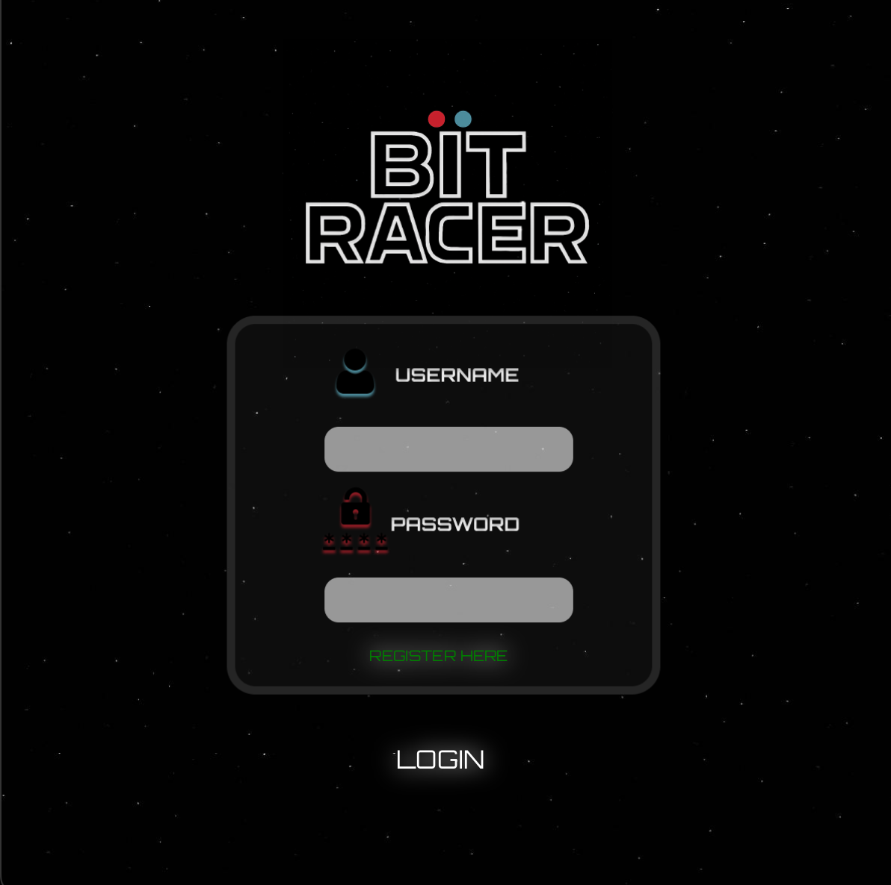
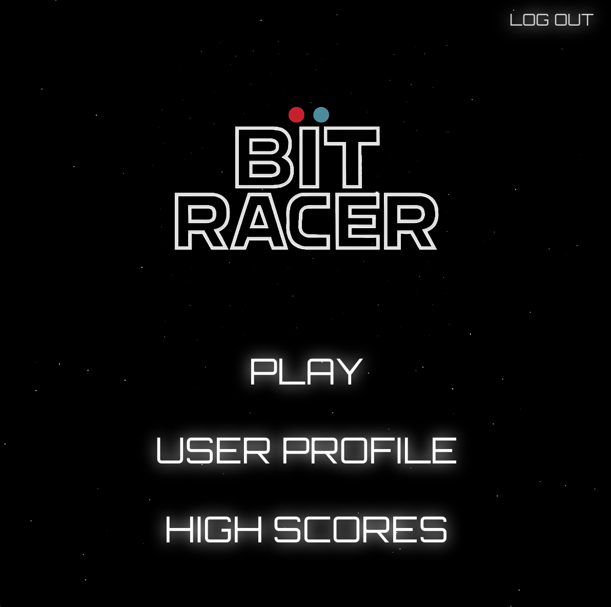
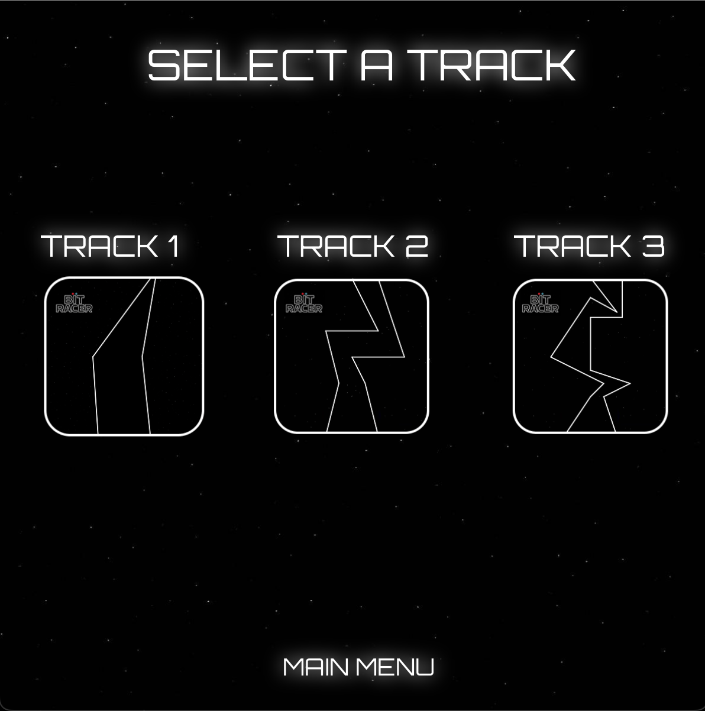
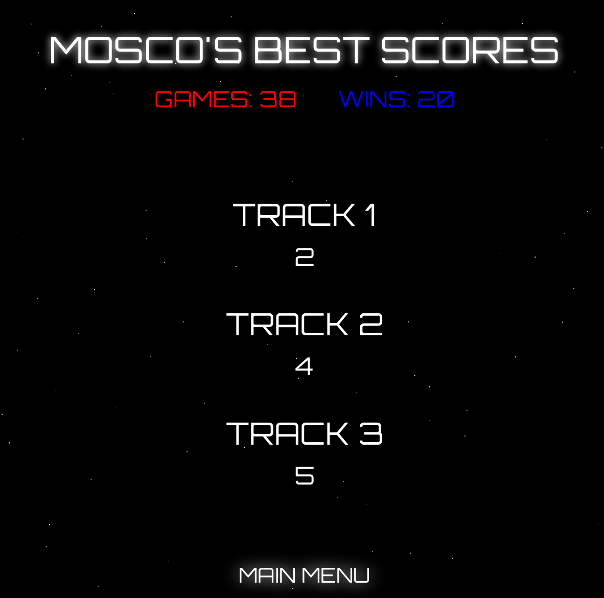
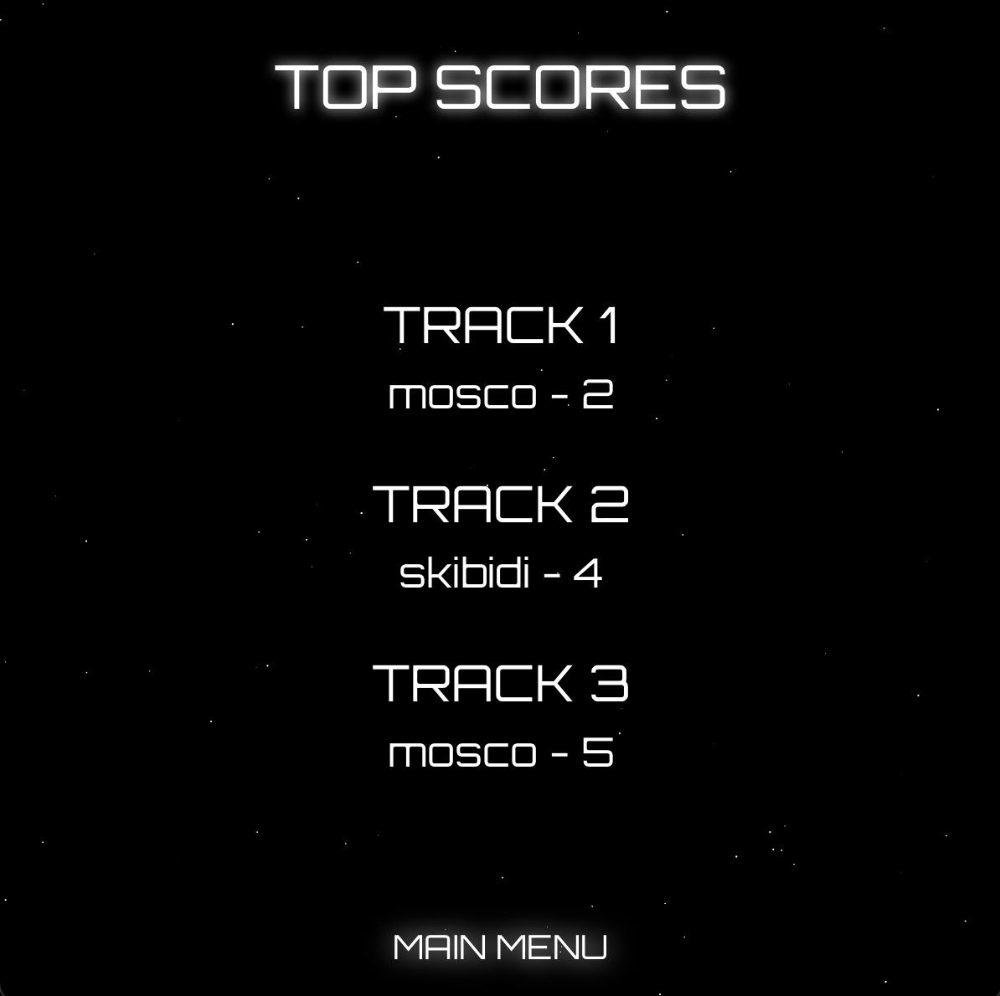

# BitRacer

BitRacer is a 2D turn-based retro racing game inspired by classic pen-and-paper vector racing.  
Players take discrete moves to navigate simple tracks, competing to reach the finish line in the fewest possible moves.

---

## Features
- Local user accounts (MySQL)
- Score tracking per match (winner, loser, score, track)
- General leaderboard (best score per track)
- Player profiles (wins, games played, personal bests)
- Multiple playable tracks (3 layouts)

---

## Controls
- Players control and launch their "bit" using the keyboard arrow keys.

---

## Scoring & Win Condition
- The first player to reach the finish line wins.
- Scores represent the number of moves taken to finish (lower is better).
- Leaderboards track the best (lowest) score per track.

---

## Tech Stack
- Java 20
- JavaFX 20.0.1
- Maven
- MySQL (local)
- MySQL Connector/J
- dotenv-java

---

## Setup (Local)

### 1) Database
Create the database schema:
```
mysql -u root -p < db/schema.sql
```

### 2) Environment Variables
Copy the example file and update the database password:
```
cp .env.example .env
```

Example `.env` file (do not commit):
```
DB_HOST=127.0.0.1
DB_PORT=3306
DB_NAME=bitracer
DB_USER=appuser
DB_PASS=CHANGE_ME
```

### 3) Run the Game
```
mvn clean javafx:run
```

---

## Screens
- LoginScreen
- UserSelectScreen
- MainScreen
- StageSelect
- GameScreen
- WinnerScreen
- GeneralScoresScreen
- UserProfileScreen

---

## Known Limitations
- Leaderboards are local-only (no online backend yet)
- Track selection is limited (3 simple tracks)
- UI styling is not yet fully consistent
- Off-track moves are currently permitted
- Two-player mode is local only

---

## Roadmap
- Enforce legal moves (reject shots that leave the track)
- Online leaderboard (API + hosted database)
- Expanded track designs
- UI polish and consistency cleanup
- AI opponent
- Online multiplayer support

---

## Media







---

## Background
BitRacer is presented as a working portfolio baseline demonstrating game logic, multi-screen JavaFX UI flow, database integration, and Maven-based build tooling.

---

## Credits
Originally created as a collaborative class project.  
Early contributions by @edwina429.